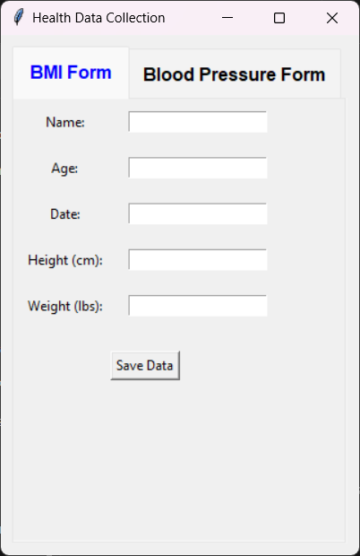
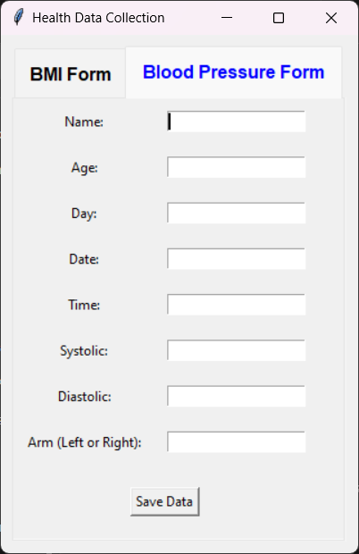

**This GitHub repository (<https://github.com/jtkrohm/Health-Applications>) contains source code for all health data analysis projects.**

# Project: BMI and Blood Pressure Data Collection






This application provides a graphical user interface, and allows users to manually log their
blood pressure (systolic and diastiolic) as well as weight and height, saving all logged data 
to an integrated document database using mongoDB


The Application contains two tabs:

 - **first tab**: displays a digital form for the collection of weight and height data for the calculation of an individual's bmi
 - **second tab**: displays a digital form for the collection of an individual's systolic and diastolic blood pressure

## Get the app
```Windows``` Download the raw executable file (it's code is not viewable on github)
The independent packaged software for this app is found [here][rawexecutable1] 

[rawexecutable1]: https://github.com/jtkrohm/Health-Applications/blob/main/aggregated_health_script_test.exe

## Prerequisites
The source code requires [mongoDB][mongolink] to be installed on the local machine: 

[mongolink]: https://www.mongodb.com/docs/manual/installation/?msockid=21c90a505ee9627631511e555f8563e4#install-mongodb
